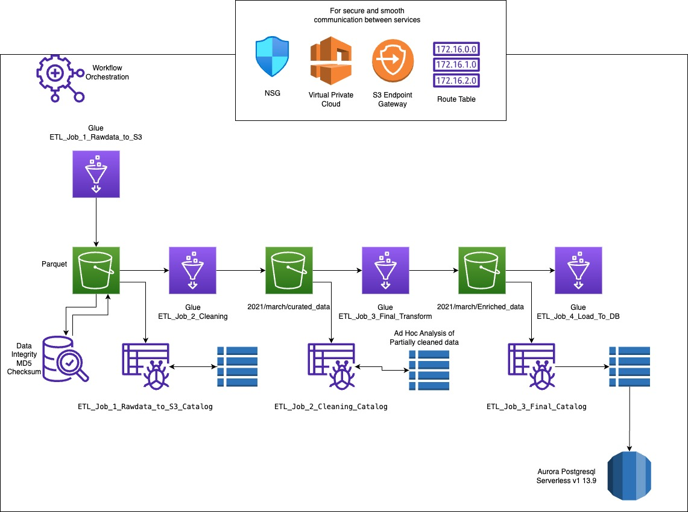

# ETL Pipeline with AWS Glue

## Gratitude

First of all I would like to earnestly thank you for giving me a reason to learn so much about AWS within a week. I would never be able to learn this much with a reason!

## Welcome to the CRUK AWS project!

This project builds a simple ETL pipeline utilizing AWS Glue, S3 Bucket and Aurora Postgresql. The pipeline is orchestrated by Glue Workflow orchestrator with error handling, data validation, data integrity check, conditional dependency and catalogs. For further data quality implementation I checked the AWS Glue integral data quality feature which allows a very robust quality checking mechanism.

This repo demonstrates a CDK app with an instance of a stack (`cruk_cdk_stack`)

---

## Sections
- [Limitations](#Limitations)
- [Product Versions](#Product-Versions)
- [Architecture](#Architecture)
- [High level work flow](#High-level-work-flow)

## Limitations
AWS Glue:

- Debugging - Does not give realtime feedback like an IDE for any syntax errors.
- Cloudwatch - The amount of information generated by cloudwatch after any fail event can be overwhelming.
- I have not used any notification mechanism for this.

## Product Versions
* Python 3
* AWS Glue version 3
* Aurora Postgresql Serverless V1 13.9

## Architecture

## High level work flow
1. Glue Job downloads a parquet file to S3 bucket.
2. Crawler creates table from it in the catalog for ad hoc analysis.
3. Gleu Job performs cleaning by taking necessary columns and push to S3.
4. Another Crawler repeats the table creation for this file.
5. Glue job performs final transformation and push to S3.
6. This time two crawlers run one for table creation from final file another creates table from postgresql database table.
7. Final Glue job loads data from catalog table to Aurora postgresql table.

## Instructions and Strategy: 
The solution provided includes a detailed explanation of the strategy and important decisions made throughout the process, which is provided in a markdown file. It discusses the choice of technologies, the structure of the ETL pipeline, and how data quality is ensured.

i. Trip durations were coming null and negative which I removed as a bad data.
ii. I only kept March 2021 data as there were also other months data.

## Meeting the Needs of the Data Analyst: 
The solution has been designed to be fully automated, and to handle the daily arrival of new data. It takes raw data from S3, cleans and transforms it, and then stores it in a convenient format for the data analyst to use. AWS Glue and Athena are used for these processes, which are easy to use and provide powerful data analysis capabilities.

## Data Quality:
Data quality is ensured at several stages of the pipeline. For example, data validation checks are implemented in the ETL jobs to ensure the data meets the expected schema and does not contain any unexpected values. In addition, AWS Glue Crawlers are used to automatically detect the schema of the data, which helps to identify any changes in the data structure.

I also implemented MD5 checksum verification for file integrity. I intended to use Delta format for ACID transaction using Databricks which make sure the atomocity, concistency, integrity and durability.

## Scalability:
The solution uses managed services like AWS Glue and Amazon Athena that can automatically scale to handle large datasets. If the dataset were to grow to 1 TiB with new data arriving each day, the main change would be to increase the resources allocated to the Glue jobs and Athena queries, which can be done easily through the AWS management console. However, it would also be important to monitor costs, as processing large amounts of data on AWS can be expensive.

For Aurora postgresql it's by design vartically scalable. But we can use sharding and also assign new readers for it to make horizontally scalable.

And regarding file size Databricks doesn’t even recommend to partition tables smaller than 1 TB because the overhead of managing numerous small partitions outweighs the performance benefits or the performance gains are often “negligible”.

However for our case since we are working with time-based data we can benefit by paritioning by time to opmize queries that analyze data within specific date range

## Monitor and Optimize Performance: 
Use Amazon RDS Performance Insights and Amazon CloudWatch to monitor your database performance. These tools can help you identify bottlenecks and optimize your database for better performance and scalability.

Thank you!
